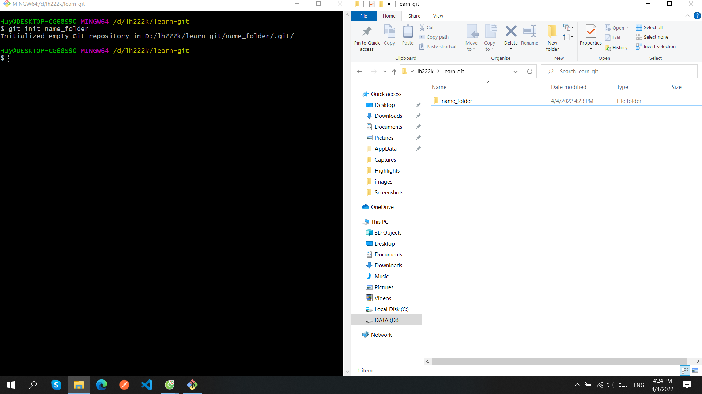
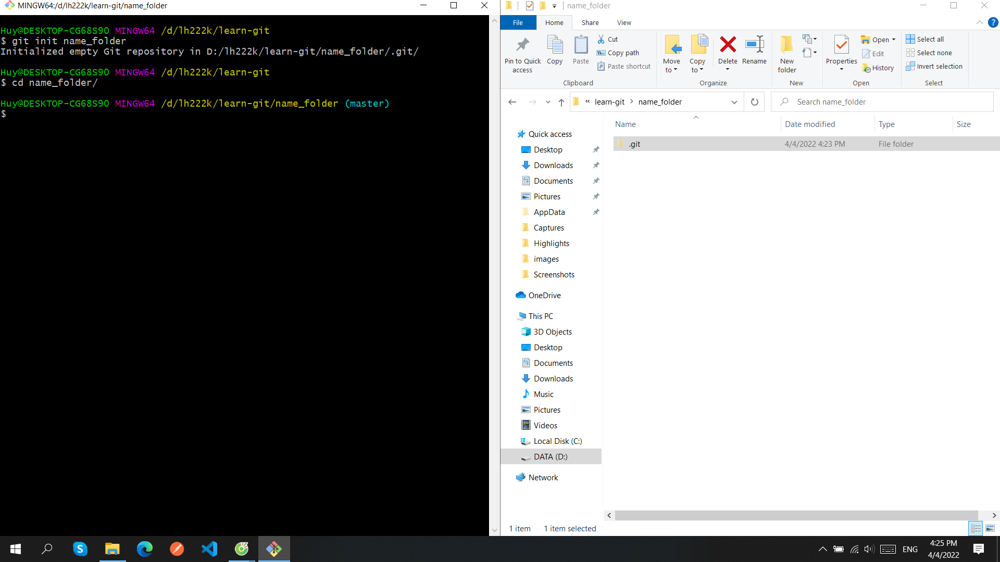
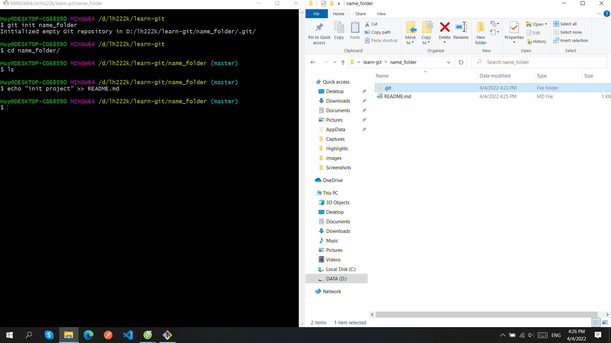
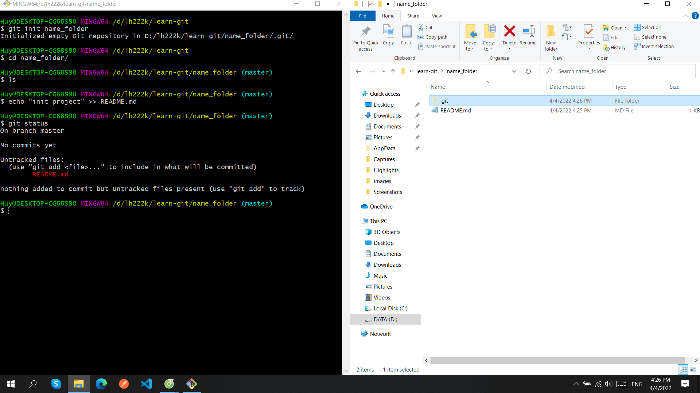
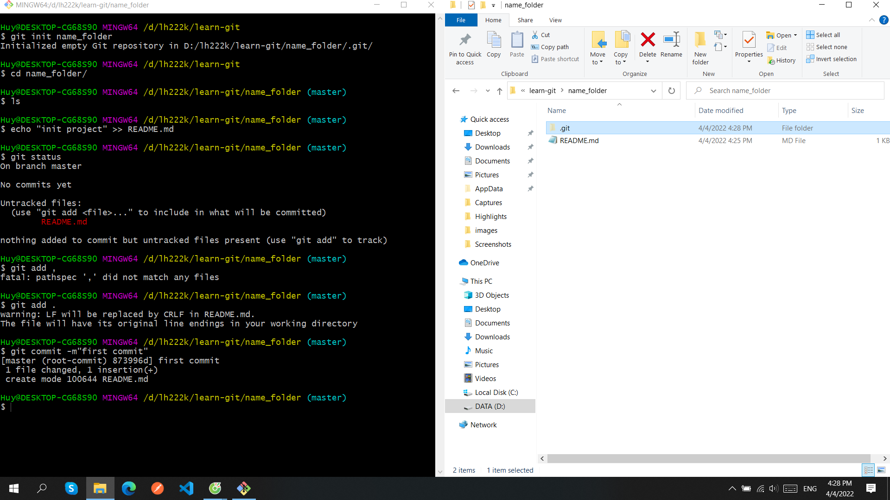
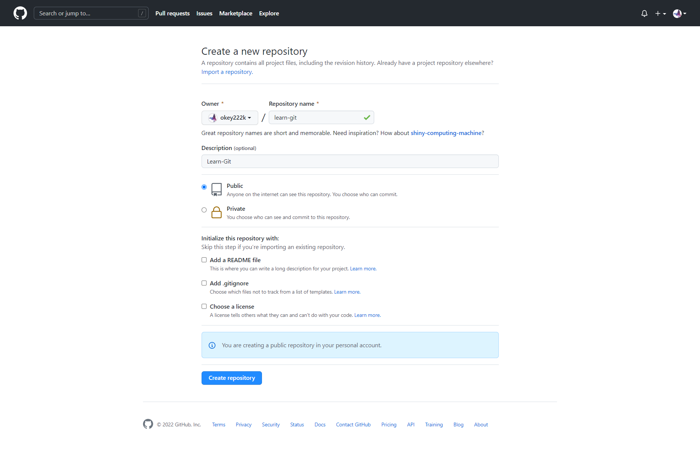
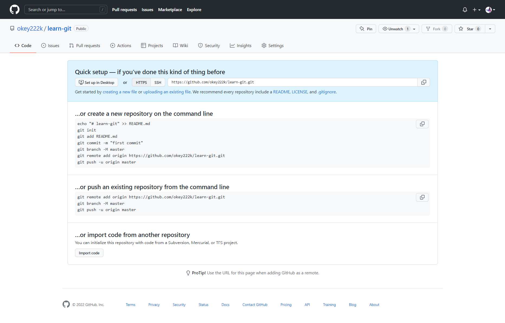

**Repository**(kho chứa)một nơi mà bạn sẽ lưu trữ mã nguồn và một người khác có thể **clone** lại mã nguồn đó nhằm mục đích công việc.

**Repository** có 2 loại:

- **Local Repository**(kho chứa trên máy tính cá nhân)
- **Remote Repository(**kho chứa trên một máy chủ từ xa)

# Tạo local repository

Trước hết, để tạo một repository thì bạn cần truy cập vào thư mục của mã nguồn với lệnh `cd`, sau đó sử dụng lệnh `git init` để khởi tạo repository trong thư mục đó. Ở ví dụ này, mình sẽ tạo tạo ra một thư mục mới để chứa code sau này và khởi tạo repository cho nó, mình sẽ dùng lệnh `git init tên_folder` để nó tự khởi tạo thư mục.

# Tạo repository trên Github và làm việc

